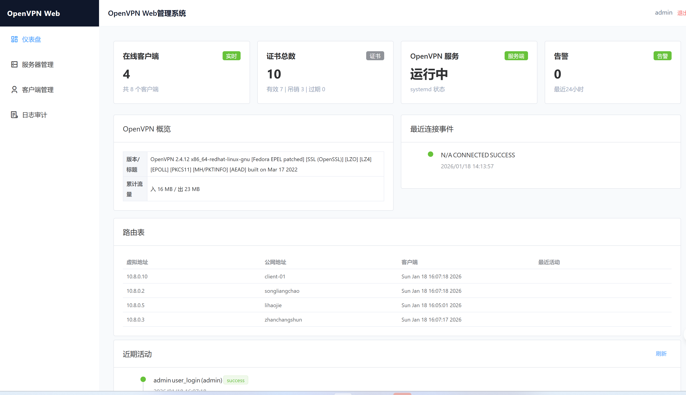
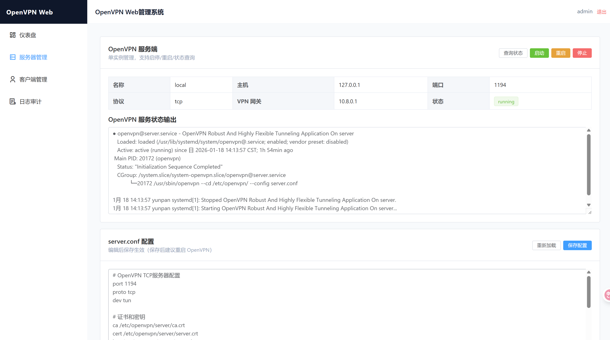
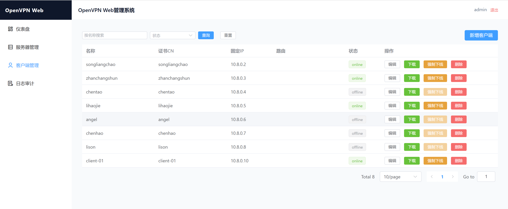
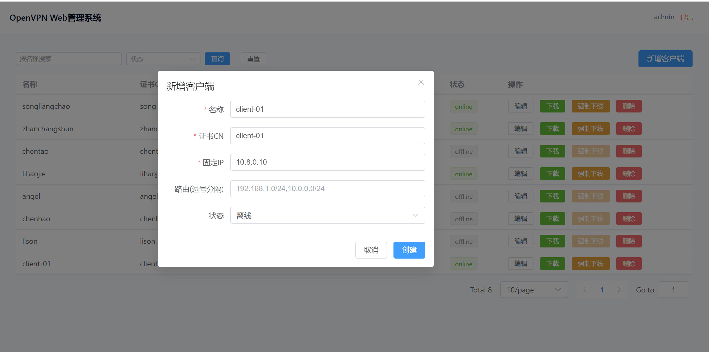
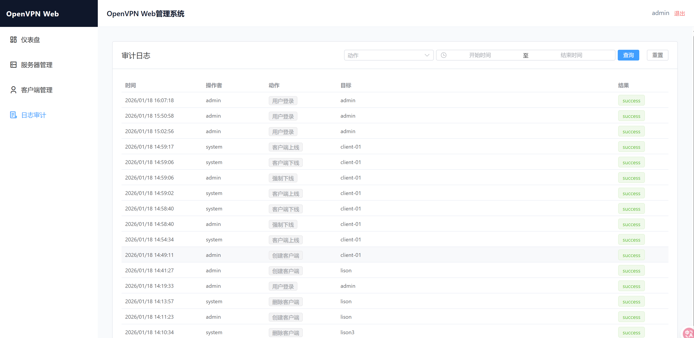

# OpenVPN Web 管理系统

基于 **FastAPI + Vue 3 + Element Plus** 的 OpenVPN 可视化管理面板，涵盖服务器/客户端管理、证书控制、系统服务控制与审计日志，便于在浏览器中完成日常运维。

## 功能概览
- 用户认证与基于 Token 的接口访问，首次启动会自动种子化管理员账号。
- OpenVPN 服务器 / 客户端的增删改查，客户端证书生成、吊销与 .ovpn 导出。
- 在线状态查询、强制下线、CCD 写回；后台统一存储时间为 Asia/Shanghai，当地时间格式化仅在前端呈现。
- OpenVPN 服务的 **启动/停止/重启/状态** 控制（systemd）。
- 审计日志：记录用户登录、客户端上线/下线、强制断开等事件，支持前端筛选（动作、时间范围）与分页。
- 前端登录守卫、API 401 自动跳转登录，支持 `/ovpnmanager/` 二级路径部署。

## 功能界面
以下为核心页面截图（位于 `docs/images/`）：








## 技术栈
- 后端：FastAPI、SQLAlchemy、Pydantic v2、SQLite
- 前端：Vue 3、Vite、Element Plus、Axios

## 目录结构（精简）
```
backend/                    # FastAPI 服务
  app/
    api/api_v1/             # 路由与接口（auth、clients、logs、dashboard 等）
    core/                   # 配置与安全
    crud/                   # 数据访问
    models/                 # ORM 模型（用户、客户端、服务器、证书、审计日志等）
    schemas/                # Pydantic 模型
    services/               # systemd、OpenVPN management、状态解析
    utils/time.py           # Asia/Shanghai 时间工具
  .env                      # 后端环境变量示例
  requirements.txt

frontend/                   # Vue 3 单页应用
  vite.config.js            # base=/ovpnmanager/，outDir=ovpnmanager
  src/api/http.js           # Axios 客户端，读取 VITE_API_BASE
  src/router/index.js       # 路由与登录守卫（/ovpnmanager/ 基础路径）
  src/utils/time.js         # 前端显示用的时间格式化
  src/views/                # Dashboard、Clients、Logs 等页面

docs/                       # 部署与操作文档（中文）
```

## 配置文件说明
- 后端 `backend/.env` 关键项：
  - `SECRET_KEY`：JWT 签名密钥。
  - `DEFAULT_ADMIN_USERNAME` / `DEFAULT_ADMIN_PASSWORD`：默认管理员（生产请修改）。
  - `ACCESS_TOKEN_EXPIRE_MINUTES`：Token 过期时间（分钟）。
  - `OPENVPN_SERVICE_NAME`：systemd 服务名，默认 `openvpn@server`。
  - `OPENVPN_BASE_PATH` / `EASYRSA_PATH` / `CCD_PATH`：OpenVPN 目录配置。
  - `OPENVPN_STATUS_PATH`：status 文件路径（在线查询）。
  - `OPENVPN_MANAGEMENT_HOST` / `OPENVPN_MANAGEMENT_PORT`：管理接口（需在 server.conf 中启用）。
  - `OPENVPN_CRL_PATH`：CRL 存放路径，吊销后会覆盖。
  - `OPENVPN_CLIENT_EXPORT_PATH`：生成 .ovpn 输出目录。
  - `TA_KEY_PATH`：`tls-auth` 密钥路径。
  - `SERVER_CONF_PATH`：server.conf 路径（可选，用于解析服务端信息）。
- 前端环境变量（`frontend/.env` 或 `.env.local`）：
  - `VITE_API_BASE`：后端 API 前缀，默认为 `http://localhost:8000/api`。部署示例：`http://192.168.1.182/api`。

### openvpn server.conf  配置文件样例
```
# /etc/openvpn/server.conf 
# OpenVPN TCP服务器配置
port 1194
proto tcp
dev tun

# 证书和密钥
ca /etc/openvpn/server/ca.crt
cert /etc/openvpn/server/server.crt
key /etc/openvpn/server/server.key
dh /etc/openvpn/server/dh.pem
tls-auth /etc/openvpn/server/ta.key 0

# 加密设置
cipher AES-256-GCM
auth SHA256

# 网络设置
server 10.8.0.0 255.255.255.0
topology subnet

# 路由推送
push "route 192.168.1.0 255.255.255.0"

# DNS设置
push "dhcp-option DNS 192.168.1.1"
push "dhcp-option DNS 114.114.114.114"


# 管理接口（仅监听本机）
management 127.0.0.1 7505
# 在线状态输出，供 /clients/online 使用
status /var/log/openvpn/openvpn-status.log
status-version 3

# 吊销校验，配合 easy-rsa 生成的 crl.pem
crl-verify /etc/openvpn/server/crl.pem

# 客户端设置
client-to-client
keepalive 10 120
persist-key
persist-tun
client-config-dir /etc/openvpn/ccd
ifconfig-pool-persist /etc/openvpn/ipp.txt
# 用户和权限
user nobody
group nobody

# 证书禁用
#script-security 3
#tls-verify /root/ovpnManager/backend/app/scripts/tls_verify.py

# 日志
log-append /var/log/openvpn/openvpn.log
verb 3

# TCP优化
socket-flags TCP_NODELAY
push "socket-flags TCP_NODELAY"
```

## 快速开始
### 前置条件
- Python 3.10+（建议使用 virtualenv）
- Node.js 18+ 与 npm / pnpm / yarn（示例使用 npm）
- 目标主机已安装并以 `systemd` 管理的 OpenVPN 服务，服务名默认为 `openvpn@server`

### 后端启动
```bash
cd backend
python -m venv .venv && source .venv/bin/activate
pip install -r requirements.txt
# 如需调整环境变量，请编辑 .env
uvicorn app.main:app --reload --host 0.0.0.0 --port 8000
```
API 文档：`http://localhost:8000/api/openapi.json`

### 前端启动（开发）
```bash
cd frontend
npm install
# 如后端地址不同，创建 .env.local 或 .env 设置 VITE_API_BASE，例如：
# VITE_API_BASE=http://localhost:8000/api
npm run dev -- --host 0.0.0.0 --port 8010
```
前端会向 `VITE_API_BASE` 发送请求；路由基础路径为 `/ovpnmanager/`。

### 前端构建
```bash
cd frontend
npm run build
# 输出目录：frontend/ovpnmanager
```

## 认证与默认账号
- 登录接口：`POST /api/auth/login`
- 默认管理员：`admin / admin456`（来自 `backend/.env`，请在生产环境修改）
- 登录成功后本地存储 `token`，路由守卫会拦截未登录访问并跳转 `/ovpnmanager/login`。

## 常用接口
- 健康检查：`GET /api/health`
- OpenVPN 服务控制：`GET /api/openvpn/status`，`POST /api/openvpn/{start|stop|restart}`
- 服务器管理：`/api/servers`（GET/POST/PATCH/DELETE）
- 客户端管理：`/api/clients`（GET/POST/PATCH/DELETE）
- 证书生成与导出：`POST /api/clients/{id}/cert`（返回内嵌 .ovpn 内容）
- 证书吊销：`POST /api/clients/{id}/revoke`
- 在线客户端：`GET /api/clients/online`（需开启 management）
- 强制下线：`POST /api/clients/{id}/disconnect`
- CCD 写入：`PATCH /api/clients/{id}/ccd`
- 审计日志：`GET /api/logs/audit`（支持动作/时间范围筛选与分页）
- 用户管理（仅超级用户）：`/api/users`

## 部署提示
- 将 `SECRET_KEY`、默认账号等敏感信息改为安全值，并限制接口访问源（CORS / 反向代理）。
- 在生产环境使用进程管理（如 systemd / gunicorn / uvicorn --workers）与 HTTPS 反向代理（Nginx/Caddy）。
- 确保后端运行账户对 OpenVPN 配置目录与 systemd 有足够权限。
- 开启并限制管理接口：在 `server.conf` 中配置 `management 127.0.0.1 7505`，并通过防火墙限制访问来源。
- 确保 `crl-verify /etc/openvpn/crl.pem` 已配置，吊销后复制 CRL 并重载/重启服务。

## Nginx 部署示例（前端前缀 /ovpnmanager，后端 /api）
后端进程监听 `127.0.0.1:8000`，前端构建产物放置到 `/www/wwwroot/ovpnmanager`（与 Vite `base=/ovpnmanager/` 对应）。示例片段：
```nginx
# 前端访问前缀
location /ovpnmanager/ {
   root /www/wwwroot;
   try_files $uri $uri/ /ovpnmanager/index.html;
   index index.html;
}

# 后端 API
location /api {
   proxy_pass http://127.0.0.1:8000;
}
```

## 参考文档
更多使用与部署细节可查看 `docs/` 目录下的中文文档：
- `OpenVPN 远程访问企业内网 - 完整部署与配置指南-TCP.md`
- `openvpn-客户端说明.md`
- `openvpn客户端内网机器双向访问.md`

## 特别鸣谢
- `GPT-5.1-Codex`
- `Element-plus`

